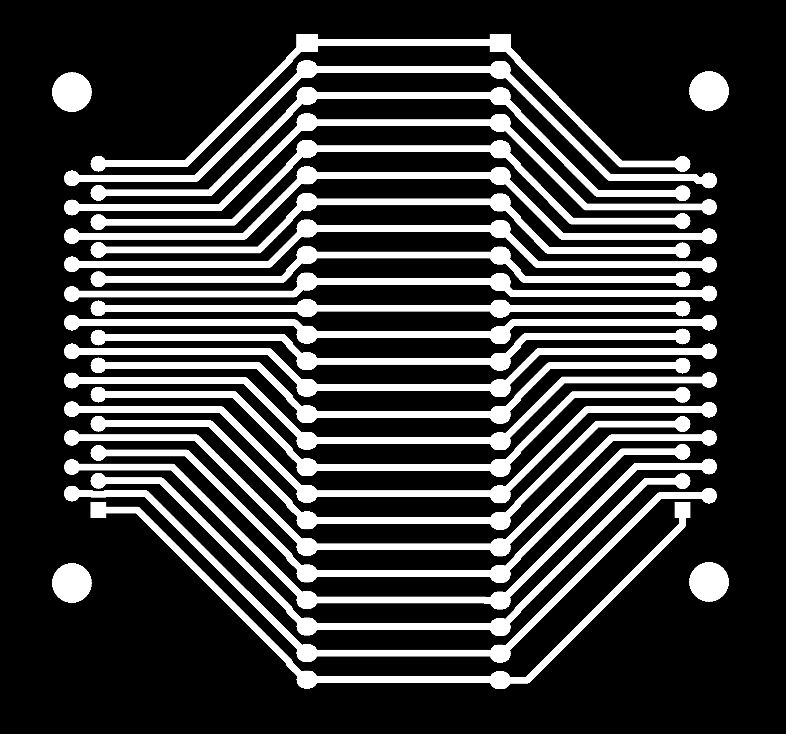
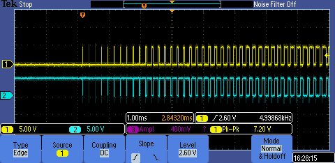
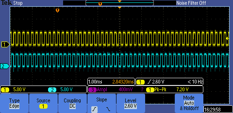
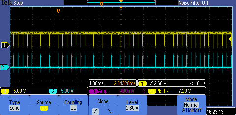

# Epilog 32 ex usage & control system

## Proposed Control System

### Electronics

* ESP8266
* 2 channel relay & driver
* 2 x leds
* RFID reader

### Software

* ESP8266 checks RFID against remote DB
* if valid, light LED
* set interrupt on pin 7, turn on relay to connect control lines 7&8.
* while interrupt is firing make remote request to DB with RFID

## Control reverse engineering

Neither Epilog or Coherent were willing to share the DSUB 25 pinout that controls the Coherent C Series laser model 1138402-AA.

Searching for the DSUB 25 format, only references to [ILDA](https://www.laserworld.com/en/show-laser-light-faq/technical-show-laser-faq/laser-projectors-technical-faq/1140-how-is-the-ilda-connector-pinout.html) were found.

A [board](bob/) that connects straight through 2 x DSUB 25 was designed in Kicad and milled

After finding system ground, all pins were tested with laser on and off:

| Pin | Laser On | Laser Off | 
| --- | -------- | --------- |
|1|0|0
|2|0|0
|3|5|5
|4|0|0
|5|0|0
|6|5|5
|7|5->0|0
|8|5|5
|9|5|5
|10|5|5
|11|5|5
|12|5|5
|13|0|0
|14|5|5
|15|5|5
|16|GND|GND
|17|0|0
|18|0|0
|19|0|0
|20|0->5|5
|21|0|0
|22|5|5
|23|5|5
|24|5|5
|25|15|15

Only pins 7 & 20 seemed to have any change when lasing. Also thought that they would be a differential signal.
Cracking out the scope gave these results for rastering, lasing at 50% power and 100% power.

Breaking connection to either pin 7 or 20 made no difference, only breaking both lines stopped the laser.

Also tested was breaking pin 4 as ILDA showed that as being the interlock signal, it made no difference.

